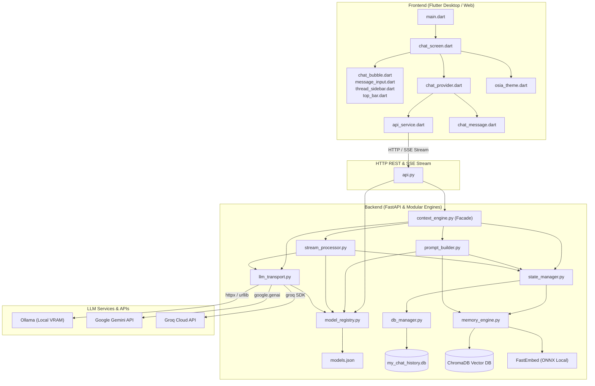

# Project OSIA — Full Codebase Architecture & Dependency Reference

This document provides a comprehensive map of the entire Project OSIA codebase (Version 1.0). It details the purpose of each file, its core responsibilities, and how files communicate and call each other.

---

## 1. System Architecture & High-Level Call Flow

---

## 2. Backend Files (`backend/` directory)

### 1. `backend/api.py`
* **Role:** Headless FastAPI REST & Server-Sent Events (SSE) server.
* **Responsibilities:**
  * Exposes HTTP endpoints for thread management, persona selection, message history, and live model streaming.
  * Manages global lifecycle startup and shutdown (initializing `ContextEngine`, closing SQLite).
  * Wraps SSE streaming (`/api/v1/chat/stream`) with an async lock (`_chat_lock`) to serialize generation requests per client.
* **Calls:**
  * `context_engine.py`: Invokes `ContextEngine` facade methods (`chat_stream`, `switch_thread`, `load_persona`, `load_history`, `create_thread`, `rename_thread`, `delete_thread`, etc.).
  * `model_registry.py`: Queries model metadata via `registry.for_api()`.
* **Called By:**
  * `api_service.dart` (Flutter frontend).

---

### 2. `backend/context_engine.py`
* **Role:** High-level conversational orchestrator and facade.
* **Responsibilities:**
  * Serves as the clean public entry point for the backend, coordinating state management, context assembly, LLM transport, and stream processing.
  * Encapsulates underlying modules (`StateManager`, `PromptBuilder`, `LLMTransport`, `StreamProcessor`) to present a unified API to `api.py`.
  * Manages synchronous (`chat`) and asynchronous streaming (`chat_stream`) execution flows.
* **Calls:**
  * `state_manager.py` (`StateManager`): Dispatches all thread, persona, history, and DB operations.
  * `prompt_builder.py` (`PromptBuilder`): Prepares assembled context and system prompt payloads.
  * `llm_transport.py` (`LLMTransport`): Triggers LLM calls.
  * `stream_processor.py` (`StreamProcessor`): Coordinates live token streaming, tag filtering, and interaction persistence.
  * `model_registry.py` (`registry`): Resolves default chat and cheap model IDs.
* **Called By:**
  * `api.py`

---

### 3. `backend/state_manager.py`
* **Role:** In-memory session state, concurrency synchronization, and thread lifecycle coordinator.
* **Responsibilities:**
  * Holds in-memory session variables: `active_session` buffer (with hard limits), `rolling_summary`, `summary_pointer`.
  * Manages thread concurrency safety via `threading.Lock()` (`self._engine_lock`).
  * Manages thread lifecycle and context switching (`switch_thread`): freezes inactive thread state (summary & scratchpad to SQLite) and thaws target thread state.
  * Handles interaction persistence (`save_interaction`): records user & assistant turns in `active_session`, commits rows to `DBManager`, and triggers asynchronous vector indexing via `MemoryEngine` in a background daemon thread.
  * Enforces memory window bounds (`_trim_active_session`, `ACTIVE_SESSION_HARD_LIMIT = 160`, `VERBATIM_WINDOW = 6`).
* **Calls:**
  * `db_manager.py` (`DBManager`): Reads and writes threads, message logs, personas, summaries, and scratchpads.
  * `memory_engine.py` (`MemoryEngine`): Embeds and stores interactions in ChromaDB.
* **Called By:**
  * `context_engine.py`, `prompt_builder.py`, `stream_processor.py`.

---

### 4. `backend/prompt_builder.py`
* **Role:** Context assembly, safety token bounding, and system prompt engineering.
* **Responsibilities:**
  * Builds complete, structured prompt message lists (`prepare_context`) for LLM inference under `_engine_lock`.
  * Specializes payload generation for autonomous manager models (`manager-lite` via `manager_payload.json`).
  * Enforces safety input token limits (`SAFETY_INPUT_LIMIT = 2500`, `SCRATCHPAD_LIMIT = 600`).
  * Queries `MemoryEngine` for semantic RAG context via ChromaDB & MMR ranking within model token budgets (`rag_budget`).
  * Evaluates summarization threshold and spawns background delta summarization (`run_delta_summary`) using the cheap background model.
  * Assembles system instructions: `<system_role>`, `<system_context>`, `<instructions>`, `<internal_scratchpad>`, `<session_summary>`, `<long_term_memory>`, and first-message `<thread_naming>` directives.
  * Attaches ISO-8601 UTC timestamps to all recent conversation history turns.
* **Calls:**
  * `model_registry.py` (`registry`): Fetches RAG budgets.
  * `state_manager.py` (`StateManager`): Reads active session, rolling summary, scratchpad, persona, user profile.
  * `memory_engine.py` (`MemoryEngine`): Computes token counts, retrieves packed context, and runs delta summarization.
  * `llm_transport.py` (`call_cheap_model_fn`): Executes background summarization LLM calls.
* **Called By:**
  * `context_engine.py` (during `chat` and `chat_stream`).

---

### 5. `backend/llm_transport.py`
* **Role:** Unified low-level multi-provider network transport and API client adapter.
* **Responsibilities:**
  * Manages client lifecycles for Groq (`groq.Groq`) and Google Gemini (`google.genai.Client`).
  * Provides unified dispatch interfaces: `call_sync(model_id, messages, thinking)` and `call_stream(model_id, messages, thinking)`.
  * Implements provider-specific network communication:
    * **Ollama:** Async HTTP streaming via `httpx.AsyncClient` (`/api/chat`), standard HTTP calls (`/api/chat`), and stateless manager execution (`/api/generate` with `keep_alive: 0`). Handles `<think>` tag extraction.
    * **Google Gemini:** `chats.create` with `send_message` and `send_message_stream` using `GenerateContentConfig`. Detects and wraps reasoning traces into `<|channel>thought>` blocks.
    * **Groq Cloud:** `chat.completions.create` supporting both native streaming and non-streaming Pydantic response fallback (e.g. reasoning effort / DeepSeek models).
  * Strips past `<|channel>thought...<channel|>` blocks from the conversation history to save context windows.
  * Exposes `call_cheap_model(messages, model_id, max_tokens)` for background summarization and manager tasks.
* **Calls:**
  * `model_registry.py` (`registry`): Resolves providers, API keys, max output tokens, and context window limits.
  * `thinking_manager.py`: Injects reasoning/thinking configurations dynamically per model.
  * Network APIs: Ollama local daemon, Google GenAI SDK, Groq SDK.
* **Called By:**
  * `context_engine.py`, `prompt_builder.py`, `stream_processor.py`.

---

### 6. `backend/stream_processor.py`
* **Role:** Real-time token streaming processor, tag interception, and interaction finalizer.
* **Responsibilities:**
  * Consumes streaming generators from `LLMTransport` and yields formatted SSE event dicts (`{"type": "chunk", ...}`, `{"type": "done", ...}`, `{"type": "error", ...}`).
  * Implements live sliding-window buffering (16-char safety buffer) to detect and suppress special internal metadata tags (`<scratchpad>`, `<thread_title>`, `<thread_naming>`) before emitting visible text to the user.
  * Streams `<|channel>thought>` and `<think>` blocks directly to the frontend for real-time UI scratchpad rendering without interrupting the chunk stream.
  * Drains remaining stream generators upon encountering hidden internal tags to capture complete metadata.
  * Extracts volatile scratchpad contents (`_extract_scratchpad`) and automatically updates `state.scratchpad`.
  * Strips `[Just now]` timestamps from the finalized backend output text before database storage.
  * Extracts thread titles (`_extract_thread_title`) and automatically triggers thread renaming in SQLite.
  * Intercepts `asyncio.CancelledError` on client abort to persist partial assistant responses and scratchpad data.
* **Calls:**
  * `state_manager.py` (`StateManager`): Updates scratchpad, renames threads, and saves final interactions.
  * `llm_transport.py` (`LLMTransport`): Consumes `call_stream` iterators.
  * `model_registry.py` (`registry`): Resolves provider routing for stream handling.
* **Called By:**
  * `context_engine.py` (`chat_stream` and `chat`).

---

### 7. `backend/memory_engine.py`
* **Role:** Vector storage, embedding generation, and Maximal Marginal Relevance (MMR) retrieval engine.
* **Responsibilities:**
  * Manages persistent ChromaDB vector collections (`my_local_memory_db`).
  * Computes 384-dimensional dense embeddings using local CPU ONNX (`fastembed` / `nomic-ai/nomic-embed-text-v1.5`).
  * Enforces `threading.Lock()` (`self._embed_lock`) around ONNX inference to prevent multi-threaded C++ race conditions and segfaults.
  * Performs MMR reranking: selects diverse, relevant historical memory chunks while reusing pre-cached ChromaDB embeddings.
  * Executes delta summarization (`run_delta_summary`) using the configured background cheap model.
* **Calls:**
  * `model_registry.py`: Resolves cheap model configuration for LLM summarization.
  * ChromaDB & FastEmbed libraries.
* **Called By:**
  * `state_manager.py` (background vector persistence), `prompt_builder.py` (context retrieval & delta summary).

---

### 8. `backend/db_manager.py`
* **Role:** SQLite persistence layer for structured relational chat history.
* **Responsibilities:**
  * Manages SQLite database (`my_chat_history.db`).
  * Handles thread CRUD operations (create, rename, delete, switch, get metadata).
  * Stores message rows (`user`, `assistant`, `system`) with timestamps and internal notes.
  * Caches persona JSON definitions and thread-level state (freezing/thawing summaries and scratchpad notes).
* **Calls:**
  * Python standard `sqlite3` library.
* **Called By:**
  * `state_manager.py`

---

### 9. `backend/model_registry.py` & `backend/models.json`
* **Role:** Single source of truth for model specifications, token budgets, and provider keys.
* **Responsibilities:**
  * Reads configuration from `models.json`.
  * Exposes helper methods: `default_chat_model()`, `default_cheap_model()`, `provider_for(model_id)`, `max_output_tokens()`, `max_context_tokens()`, `rag_budget()`, `get_api_key()`.
  * Dynamically reads provider API keys from `.env`.
* **Calls:**
  * Reads `models.json` and `.env`.
* **Called By:**
  * `api.py`, `context_engine.py`, `prompt_builder.py`, `llm_transport.py`, `stream_processor.py`, `memory_engine.py`, `thinking_manager.py`.

---

### 10. `backend/thinking_manager.py`
* **Role:** Centralized reasoning and thinking configuration manager.
* **Responsibilities:**
  * Dynamically applies model-specific reasoning payloads (e.g., Gemini `thinkingConfig`, Groq `reasoning_effort`, KoboldCpp `chat_template_kwargs`).
  * Prevents API crashes by conditionally checking `supports_thinking` before injecting reasoning parameters.
* **Calls:**
  * `model_registry.py` (`registry.supports_thinking`)
* **Called By:**
  * `llm_transport.py`

---

## 3. Frontend Files (`flutter_ui/` directory)

### 1. `flutter_ui/lib/main.dart`
* **Role:** Application entry point and process lifecycle manager.
* **Responsibilities:**
  * Bootstraps Flutter desktop app and initializes global providers (`MultiProvider`).
  * Automatically spawns the Python backend (`api.py`) on desktop launch (PID tracking) and terminates it on exit.
* **Calls:**
  * `chat_provider.dart`, `chat_screen.dart`, `osia_theme.dart`.

---

### 2. `flutter_ui/lib/providers/chat_provider.dart`
* **Role:** Central state management (`ChangeNotifier`) for UI interaction, threads, and streaming.
* **Responsibilities:**
  * Holds state for active messages, thread list, available personas, model selection, thinking toggle, and app status (`ready`, `thinking`, `streaming`, `error`).
  * Manages real-time SSE token stream parsing:
    * Accumulates raw chunks into a full buffer.
    * Uses RegExp to extract reasoning tags (`<think>`, `<|channel>thought`, `<channel|>`) into `ChatMessage.thinkContent`.
    * Strips hidden system tags (`<scratchpad>`, `<thread_title>`) and temporal markers (`[Just now]`).
  * Implements `_notifyThrottled()` (50ms timer) to prevent Flutter frame drop during high-speed streaming.
* **Calls:**
  * `api_service.dart` (for all backend network communication).
  * `chat_message.dart` (data models).
* **Called By:**
  * All UI screens and widgets.

---

### 3. `flutter_ui/lib/services/api_service.dart`
* **Role:** HTTP client abstraction for communicating with `api.py`.
* **Responsibilities:**
  * Implements Server-Sent Events (SSE) stream listener (`sendMessageStream`) using `http.Client`.
  * Implements REST API calls: `getThreads()`, `switchThread()`, `createThread()`, `deleteThread()`, `getPersonas()`, `loadPersona()`, `getModels()`, `healthCheck()`.
* **Calls:**
  * `http` package, `dart:convert`.
* **Called By:**
  * `chat_provider.dart`

---

### 4. `flutter_ui/lib/screens/chat_screen.dart`
* **Role:** Main desktop layout scaffold.
* **Responsibilities:**
  * Assembles the responsive chat view: `ThreadSidebar` (collapsible left drawer), `TopBar` (model/persona controls), message scroll area, and `MessageInput` bar.
* **Calls:**
  * `thread_sidebar.dart`, `top_bar.dart`, `chat_bubble.dart`, `message_input.dart`.

---

### 5. `flutter_ui/lib/screens/widgets/`
* **`chat_bubble.dart`**: Renders individual chat bubbles. Implements expandable collapsible reasoning box (`Thinking Process`), markdown rendering (`flutter_markdown`), math rendering (`flutter_math_fork`), and code block copy buttons.
* **`message_input.dart`**: Multi-line chat text input bar with keyboard shortcuts (Enter to submit, Shift+Enter for newline) and the interactive `Think` toggle button.
* **`top_bar.dart`**: Top status bar displaying current model selector dropdown, persona picker dropdown, active thread name, and latency/status indicators.
* **`thread_sidebar.dart`**: Left panel displaying chronological conversation threads (grouped into *Today*, *Yesterday*, *Last 7 days*, *Older*), new chat creation button, and thread renaming/deletion actions.

---

### 6. `flutter_ui/lib/models/chat_message.dart` & `flutter_ui/lib/theme/osia_theme.dart`
* **`chat_message.dart`**: Data model representing single chat messages (`role`, `content`, `thinkContent`, `scratchpad`, `timestamp`, `isStreaming`).
* **`osia_theme.dart`**: Dark/cyber aesthetic design system tokens, color palettes, glassmorphism card styles, and typography constants.

---

## 4. Complete Call Flow Matrix

| Caller | Target File | Action / Function Called | Purpose |
| :--- | :--- | :--- | :--- |
| **`main.dart`** | `api.py` | `Process.start("python", ["api.py"])` | Starts backend daemon on app launch |
| **`chat_screen.dart`** | `chat_provider.dart` | `Provider.of<ChatProvider>()` | Listens to state changes and triggers actions |
| **`message_input.dart`** | `chat_provider.dart` | `provider.sendMessage(text, thinking)` | Dispatches user prompt |
| **`chat_provider.dart`** | `api_service.dart` | `api.sendMessageStream(...)` | Initiates HTTP POST SSE stream |
| **`api_service.dart`** | `api.py` | `POST /api/v1/chat/stream` | Transmits request over local network |
| **`api.py`** | `context_engine.py` | `engine.chat_stream(msg, model, thinking)` | Begins asynchronous AI generation facade |
| **`context_engine.py`** | `prompt_builder.py` | `PromptBuilder.prepare_context(...)` | Assembles context, RAG, history, and prompt |
| **`prompt_builder.py`** | `memory_engine.py` | `memory.retrieve_packed_context(...)` | Fetches semantic RAG history via ChromaDB |
| **`prompt_builder.py`** | `memory_engine.py` | `memory.run_delta_summary(...)` *(bg thread)* | Generates rolling summary slice if threshold met |
| **`prompt_builder.py`** | `state_manager.py` | `state.active_session`, `state.scratchpad` | Ingests active session context & thoughts |
| **`context_engine.py`** | `stream_processor.py` | `StreamProcessor.process_stream(...)` | Initiates buffered stream interception |
| **`stream_processor.py`** | `llm_transport.py` | `transport.call_stream(...)` | Calls multi-provider network stream |
| **`llm_transport.py`** | **Ollama / Gemini / Groq** | Native provider streaming | Streams tokens back chunk-by-chunk |
| **`stream_processor.py`** | `state_manager.py` | `state.save_interaction(...)` | Stores finalized turn & scratchpad |
| **`stream_processor.py`** | `state_manager.py` | `state.rename_thread(...)` | Automatically renames thread if title emitted |
| **`state_manager.py`** | `db_manager.py` | `db.save_chat_rows(...)` | Stores finalized turn in SQLite |
| **`state_manager.py`** | `memory_engine.py` | `memory.save_to_vector_db(...)` *(bg thread)* | Computes ONNX embedding in background |
| **`stream_processor.py`** | `api.py` | SSE `yield {"type":"chunk", ...}` | Yields clean chunks through FastAPI SSE endpoint |
| **`api.py`** | `api_service.dart` | SSE `data: {"type":"chunk", ...}` | Delivers chunks to frontend |
| **`chat_provider.dart`** | `chat_bubble.dart` | `notifyListeners()` | Rerenders UI with streaming thoughts and tokens |
